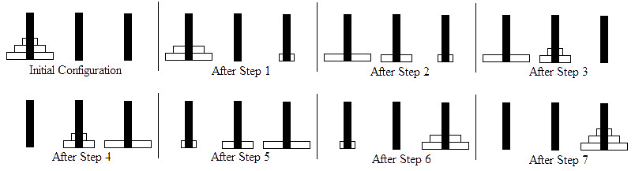

*The "Lucas' Tower" problem (also known as the "Tower of Hanoi") is a puzzle that consists of three vertical pins arranged in a row and one or more disks with holes in their centres so that they can slide onto the pins. No two disks are the same size. The classic version of this puzzle starts with all the disks on the leftmost pin in order of size with the smallest on top, as shown below.*


*The goal is to move the entire stack of disks onto the rightmost pin so that they are stacked in the same order as they were originally, following the rules below:*

1. *You can only move one disk at a time.*
2. *You can only move the top disk from one stack onto the top of another stack or onto an empty pin.*
3. *You can never place a disk on top of a smaller disk.*

*The "Lucas' Other Tower" problem is less well known. (Actually, we made it up.) In this problem the start position, goal and number of pins are the same. The disks are all of different sizes, but those sizes are integer diameters from `1` to `N` centimetres, where `N` is the number of disks in the puzzle. The first two rules are the same as before but there is also a positive non-zero integer `T` known as the "tolerance factor" which is used to make the third rule more or less restrictive as shown in the rules below:*

1. *You can only move one disk at a time.*
2. *You can only move the top disk from one stack onto the top of another stack or onto an empty pin.*
3. *You can never place a disk on top of another disk that is more than `T` centimetres larger or smaller.*



*The input will contain `10` test cases. Each test case consists of two integers `N` and `T` on a single line separated by a space (`3 <= N <= 10^6`,  `1 <= T <= 10^4`). These numbers define an instance of the Lucas' Other Tower problem where `N` is the number of disks and `T` is the tolerance factor.*

*Your task is to report the minimum number of moves necessary to solve this instance of the problem.*

Sample Input
```
3 2
```

Sample Output
```
7
```
[Reference](https://dmoj.ca/problem/ecoo15r2p3)